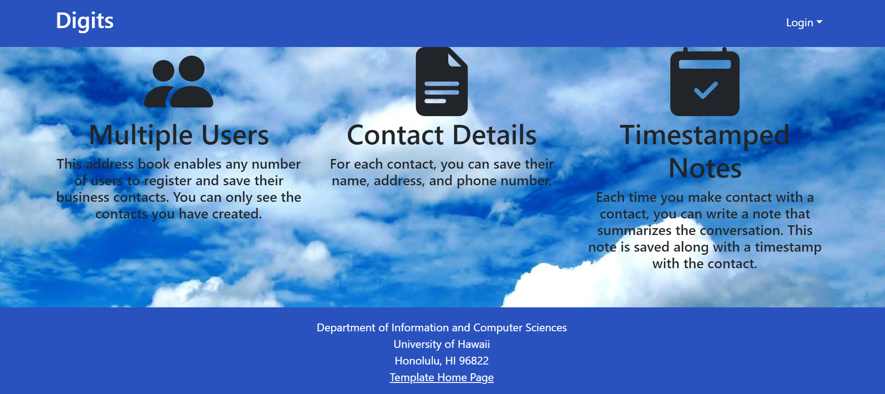
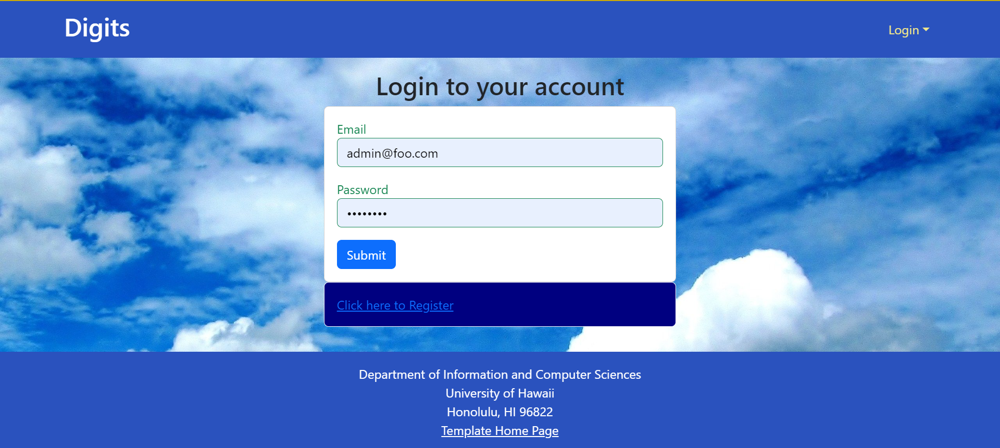
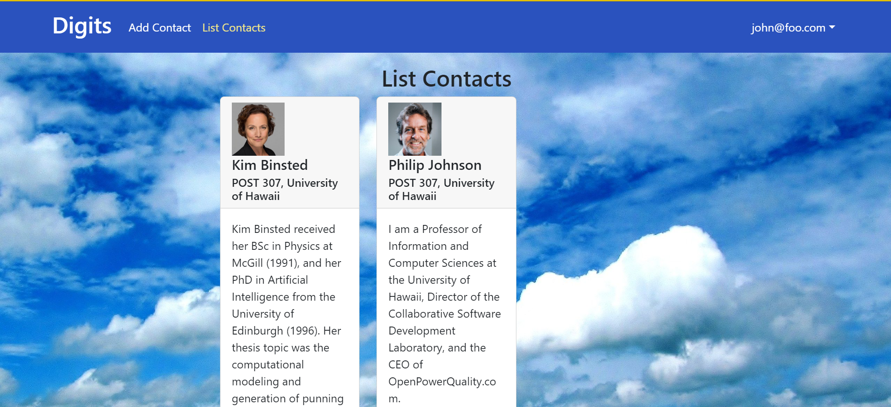
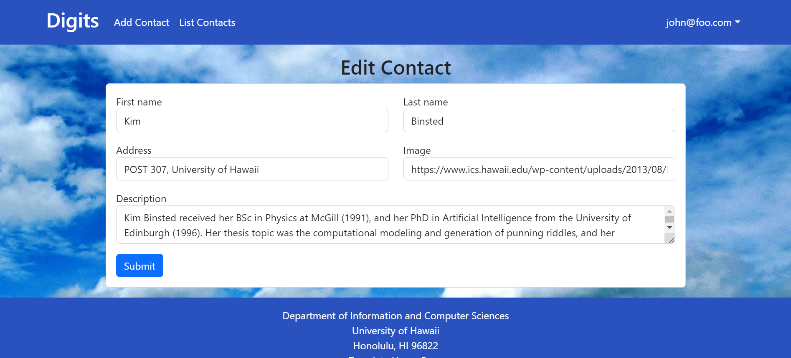
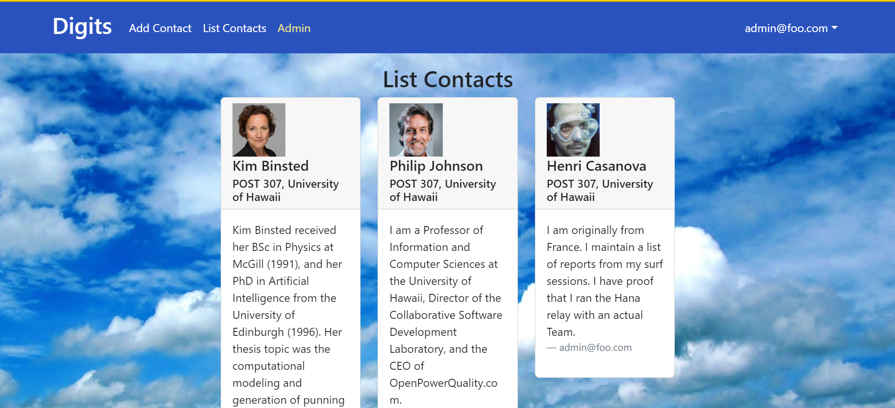

# Digits



## Table of contents

* [Installation](#installation)
* [Landing Page](#landing)
* [Register](#register)
* [Sign In](#signin)
* [Home Page](#homepage)
* [List Contacts](#listcontacts)
* [Edit Contacts](#editcontacts)
* [Admin](#admin)


### Installation 

First, install Meteor.

Second, download a copy of Digits. Note that Digits is a private repo and so you will need to request permission from the author to gain access to the repo.

Third, cd into the app directory install the required libraries with:

```$ meteor npm install```

Once the libraries are installed, you can run the application by invoking:

```$ meteor npm run start```

When you first run the app in the terminal there will be lots of words, it just means that the app is creating defualt users and data.  If all goes well, the template application will appear at http://localhost:3000. You can login using the credentials in settings.development.json, or else register a new account.

## User Guide

This section provides a walkthrough of the Digits user interface and its capabilities.

### Landing Page

The landing page is presented to users when they visit the top-level URL to the site.


### Register

If all goes well, the template application will appear at http://localhost:3000. You can login using the credentials in settings.development.json, or else register a new account.


### Sign In

Click on the Login link, then click on the Signin link to bring up the Sign In page which allows you to login:




### Home page

After successfully logging in, the system takes you to your home page. It is just like the landing page, but the NavBar contains links to list contact and add new contacts:


### List Contacts

Clicking on the List Contacts link brings up a page that lists all of the contacts associated with the logged in user:



This page also allows the user to add timestamped “notes” detailing interactions they’ve had with the Contact. For example:


### Edit Contacts

From the List Contacts page, the user can click the “Edit” link associated with any Contact to bring up a page that allows that Contact information to be edited:




### Admin

It is possible to designate one or more users as “Admins” through the settings file. When a user has the Admin role, they get access to a special NavBar link that retrieves a page listing all Contacts associated with all users:



